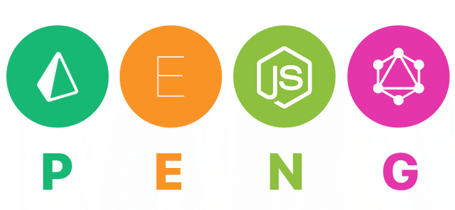

# Greedy Amigo Backend

## 🏗 Architecture

## 🚀 Getting started
The Greedy Amigo backend has four major dependencies which you need to install:
1. [Docker](https://www.docker.com/get-started)
2. Node.js `brew install node`
3. Prisma `npm install -g prisma`
4. Graphqlgen `npm install -g graphqlgen`

### Environment
Create a `.env` file in the graph folder with your JWT SECRET:

* `JWT_SECRET=` 

Also set your `NODE_ENV`:

* `NODE_ENV=development`

### Build & Run
Run `npm install` in the graph folder and `docker-compose build` in the root directory to build the images. Afterwards execute `docker-compose up` to start the containers.

### Testing
* `http://localhost:4646` will show the Prisma UI
* `http://localhost:4000` will show the GraphQL playground

### Showcase
#### Dashboard

#### Edit thing

## 📝 Attributions
### Apollo & GraphQL
* [apollo-server](https://github.com/apollographql/apollo-server)
* [apollo-server-express](https://github.com/apollographql/apollo-server/tree/master/packages/apollo-server-express)
* [graphql](https://github.com/facebook/graphql)
* [graphql-import](https://github.com/prisma/graphql-import)
* [graphql-tools](https://github.com/apollographql/graphql-tools)

### Prisma
* [prisma](https://github.com/prisma/prisma)
* [prisma-client-lib](https://github.com/prisma/prisma/tree/master/cli/packages/prisma-client-lib)

### Validation & Authentication
* [jsonwebtoken](https://github.com/auth0/node-jsonwebtoken)
* [bcryptjs](https://github.com/dcodeIO/bcrypt.js)
* [email-validator](https://github.com/manishsaraan/email-validator)
* [password-validator](https://github.com/tarunbatra/password-validator)

### Others
* [dotenv](https://github.com/motdotla/dotenv)
* [serve-favicon](https://github.com/expressjs/serve-favicon)
* [ts-node](https://github.com/TypeStrong/ts-node)
* [typescript](https://github.com/Microsoft/TypeScript)

### Images
* [Monkey Vector](https://www.freepik.com)
* [Icons](https://www.flaticon.com/)

## 📖 Ressources
* [GraphQL vs. REST](https://philsturgeon.uk/api/2017/01/24/graphql-vs-rest-overview/)
* [What the hell is Prisma the GraphQL thing](https://medium.com/@brandonmp/what-the-hell-is-prisma-the-graphql-thing-4e30b0c6c65b)
* [How to GraphQL](https://philsturgeon.uk/api/2017/01/24/graphql-vs-rest-overview/)
